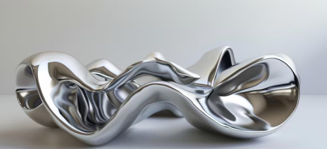

<p align="center"></p>
<h1 align="center">Hydrochrome</h1> 
<h4 align="right">Sep 24</h4>


<br>

# Table of contents
- [Table of contents](#table-of-contents)
- [General Tools:](#general-tools)
- [Hydrochrome](#hydrochrome)
    - [Activador](#activador)
    - [Componente A](#componente-a)
    - [Componente B](#componente-b)
- [Troubleshooting](#troubleshooting)
- [Cromado al fuego](#cromado-al-fuego)
- [Troubleshooting](#troubleshooting-1)
- [Efecto Cristal en objetos](#efecto-cristal-en-objetos)
- [Contactos proveedores de materiales químicos Chile](#contactos-proveedores-de-materiales-químicos-chile)
  - [Curso](#curso)

<br>

# General Tools:
* Soplete Flameador a gas
* Paletas de madera (papelerias)
* Balanza De Cocina Digital

<br>

# Hydrochrome
Materiales:
### Activador
* Cloruro de estaño (SnCl₂ / SnCl₄)
* Acido clorhídrico (HCl) al 33 o 37%
* Agua destilada (H₂O)

### Componente A
* Nitrato de plata (AgNO₃)
* Agua destilada (H₂O)
* Amoniaco (NH₃)
* Soda caustica (NaOH)

### Componente B
* Glucosa (C₆H₁₂O₆)
* Alcohol isopropilico (C₃H₈O)
* Agua destilada (H₂O)

<br>

# Troubleshooting
> :warning: **Warning:**


<br>

<br>

# Cromado al fuego
Materiales:
* Alcohol Polivinílico o alcohol PVA en polvo o gránulado C₂H₄O o CH₂CHOH
* Alcohol isopropilico (C₃H₈O)
* Nitrato de plata (AgNO₃)

Herramientas:
* Pincel
* Recipiente xxx

<br>

# Troubleshooting
> :warning: **Warning:**


<br>

<br>

# Efecto Cristal en objetos
Materiales 
* Urea (CO(NH₂)₂) 
* Agua (H₂O)
* Jabón liquido quita grasa

<br>

<br>

# Contactos proveedores de materiales químicos Chile

Químicas industriales  +56961597549 /+56226352641

<br>

--------------------------

```Alcohol polivinílico o alcohol PVA (C₂H₄O)``` (+569) 6421 0291

Alcohol Polivinilico 20KG - Productos Químicos $169.900 + IVA <br>
https://productosquimicos.cl/producto/alcohol-polivinilico-20kg/?srsltid=AfmBOoqPt9gbKuUJ11KxH1kOjLuJSJCjdLpq81R_RPqvutKfhbnyJnxR

Tienda: De antaño <br>
Dirección: Plaza Pedro de Valdivia 1783 local 142, 3º piso, Providencia, Centro Comercial Madrid (a un costado del Líder Express). <br>
fono: (+569) 4092 3586 <br>

-------------------------
<br>

```HydroLab Chile``` +56952449624. Para pedido de las láminas de hidroimpresión mas su activador

-----------------------

<br>

https://www.bioquimica.cl/ <br>
ventas@bioquimica.cl <br>
Whatsapp: +56 9 6459 0249 <br>
Llámanos: +56 2 2225 2583 <br>

<br>

## Curso
Mundo Resina la Capital del Sur (+591)7383 7637 / (+591)7249 0977 (Bolivia) / (+569)3599 8223 (Iquique, Chile)<br>
email: platon220291@gmail.com <br>
https://platon220292.wixsite.com/ <br>
Persona de contacto: Claudio.


<br>


---
Copyright &copy; 2022 [carjavi](https://github.com/carjavi). <br>
```www.instintodigital.net``` <br>
carjavi@hotmail.com <br>
<p align="center">
    <a href="https://instintodigital.net/" target="_blank"></a>
</p>

